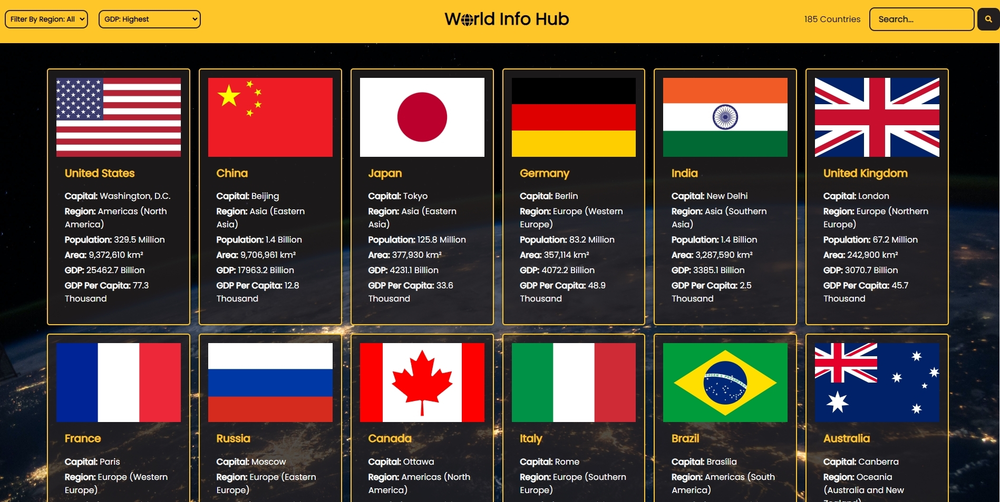

# World-Info-Hub

 World-Info-Hub is a website that displays information about countries from around the globe. It provides key data such as population, languages, currencies, and GDP, utilizing reliable APIs as data sources. Users can easily filter countries by region or search for specific nations to view relevant details. Access World-Info-Hub here:
[Click here to check it out](https://worldinfohub.up.railway.app/)

APIs used:
Rest Countries API:

API Documentation: https://restcountries.com
GitHub Repository: https://github.com/apilayer/restcountries

World Bank GDP API:

API Documentation: https://datahelpdesk.worldbank.org/knowledgebase/articles/889392-about-the-indicators-api-documentation
World Bank Data Website: https://data.worldbank.org/indicator/NY.GDP.MKTP.CD

